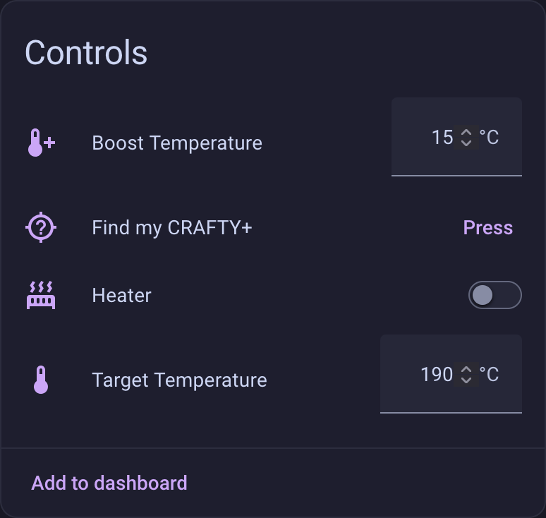
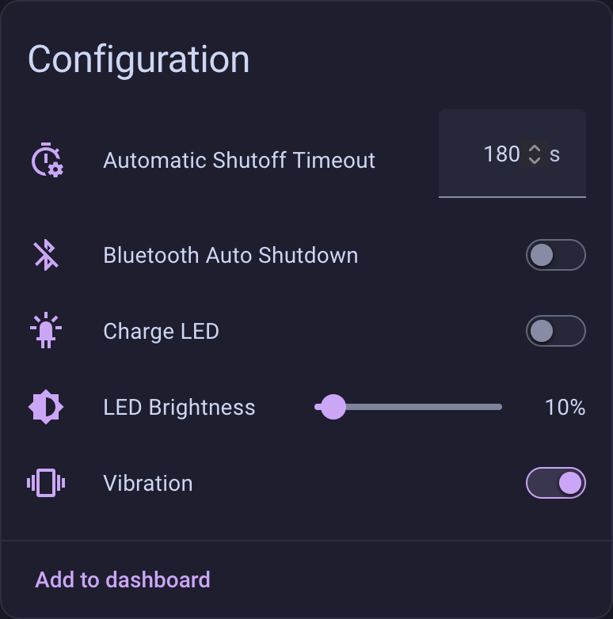
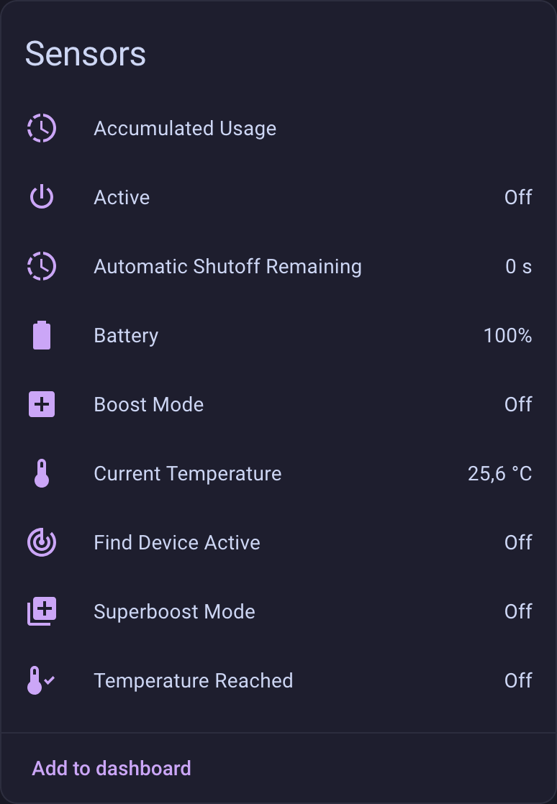
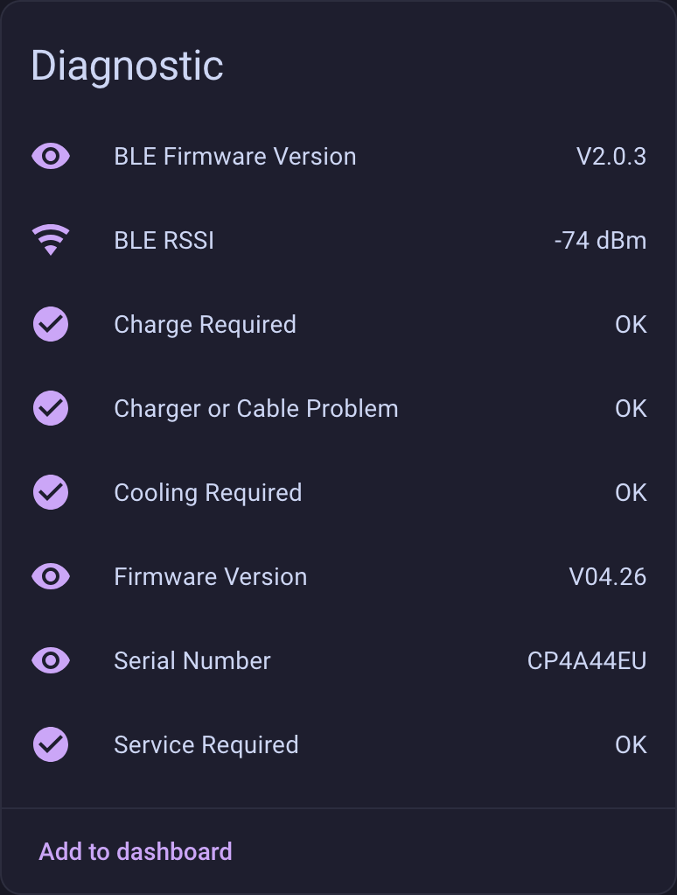

# ESPHome CRAFTY+

[](https://github.com/valentinvoigt/esphome-storzundbickel-craftyplus/actions/workflows/esphome.yml)
[](LICENSE)

This ESPHome package connects to a STORZ & BICKEL CRAFTY+ over BLE and exposes its telemetry, settings, controls, and diagnostics to Home Assistant.

## Features

- Monitor temperature, battery level, automatic-shutoff time, usage, and device information.
- Set the target and boost temperatures, LED brightness, and automatic-shutoff timeout.
- Control the heater, vibration, charge LED, Bluetooth shutdown, and find-device function.
- Report operating modes and device diagnostics in Home Assistant.

## Home Assistant

<p>
  <a href="screenshots/home-assistant-controls.png"></a>
  <a href="screenshots/home-assistant-configuration.png"></a><br>
  <a href="screenshots/home-assistant-sensors.png"></a>
  <a href="screenshots/home-assistant-diagnostics.png"></a>
</p>

## Requirements

You need a CRAFTY+, an ESP32 board with Bluetooth support, and an existing [ESPHome](https://esphome.io/install/getting-started/) installation. I use ESPHome Device Builder with a generic BLE-capable ESP32 board. [Home Assistant](https://www.home-assistant.io/integrations/esphome/) is required to use the exposed entities in its user interface.

## Installation

1. Create a regular ESPHome configuration for your ESP32 in ESPHome Device Builder, including its board, Wi-Fi, API, and OTA settings. If ESPHome is new to you, follow the [ESPHome getting-started guide](https://esphome.io/install/getting-started/) first.
2. Add this package to that configuration, replacing the display name and example MAC address with those of your CRAFTY+:

```yaml
substitutions:
  crafty_name: "CRAFTY+"
  crafty_mac_address: "AA:BB:CC:DD:EE:FF"

packages:
  crafty_plus: github://valentinvoigt/esphome-storzundbickel-craftyplus/crafty-plus.yaml@main
```

3. Compile and install the resulting configuration with ESPHome. Once the ESP32 is online, add or accept the discovered ESPHome device in Home Assistant.

Keep the ESP32 within reliable Bluetooth range of the CRAFTY+. The integration maintains a native ESPHome BLE client connection to one device.

> [!IMPORTANT]
> The integration normally keeps its BLE connection to the CRAFTY+ open continuously. While it is connected, other devices cannot connect to the CRAFTY+, which means you cannot reconfigure it from another computer or phone. To make the CRAFTY+ available immediately, remove this package from the ESPHome configuration or power down the ESPHome device.
>
> The CRAFTY+ enables BLE while it is switched on or charging. Its Bluetooth automatic-shutdown setting can keep BLE available while the device is switched off and not charging, but doing so increases battery drain.

## Project notes

I had fun using an LLM to help me write repetitive code and make some minor changes. I did the reverse engineering myself and read and understood every line of code.

My generic ESP32 also acts as an ESPHome `bluetooth_proxy` for other Bluetooth devices. The CRAFTY+ integration itself uses ESPHome's BLE client directly. I have not tested accessing the CRAFTY+ outside ESPHome, using Home Assistant's native Bluetooth support, or connecting through a separate Bluetooth proxy.

## License

This project is available under the [MIT License](LICENSE). You may use, modify, redistribute, and commercially use it as long as the copyright and license notice are retained.

## Disclaimer

This is an unofficial project and is not affiliated with, endorsed by, or supported by STORZ & BICKEL. The software is provided without any guarantee of functionality, compatibility, or safety. Use it at your own risk and follow the device manufacturer’s safety instructions. This integration can control the heater and temperature settings; verify important settings on the device and do not leave it operating unattended.

To the extent permitted by applicable law, the author and contributors are not liable for damage arising from its use. This does not limit liability that cannot legally be excluded or restricted.
